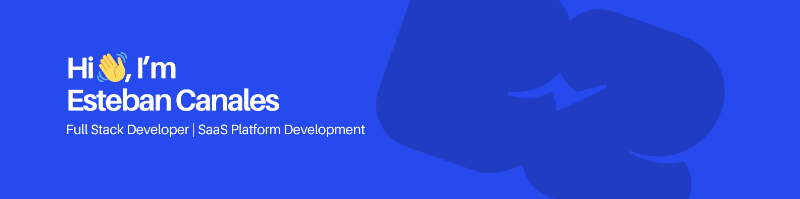

  

## I'm a Senior Full Stack Web Developer

- 🌱 I’m currently focused on Full Stack Development, SaaS Platforms, and AI-powered systems.
- 💬 Ask me anything about Javascript, Typescript, React, Next.js, Node.js, and modern web development.
- 🥅 Goals: Build impactful real-world products, contribute to innovative projects, and continue growing as a software engineer and technical leader.
- ⚡ Fun fact: I’m passionate about technology, design, cybersecurity, and building systems from scratch.
- 🤝 Reach out to me on [gmail](mailto:estebancomoprogramador@gmail.com)
- 📝 [LinkedIn](https://www.linkedin.com/in/esteban-canale-monge-21417a32a/)

## 🛠️ Tech Stack

### Programming Languages

### Frameworks & Libraries

### Tools & Platforms

### Operating Systems

